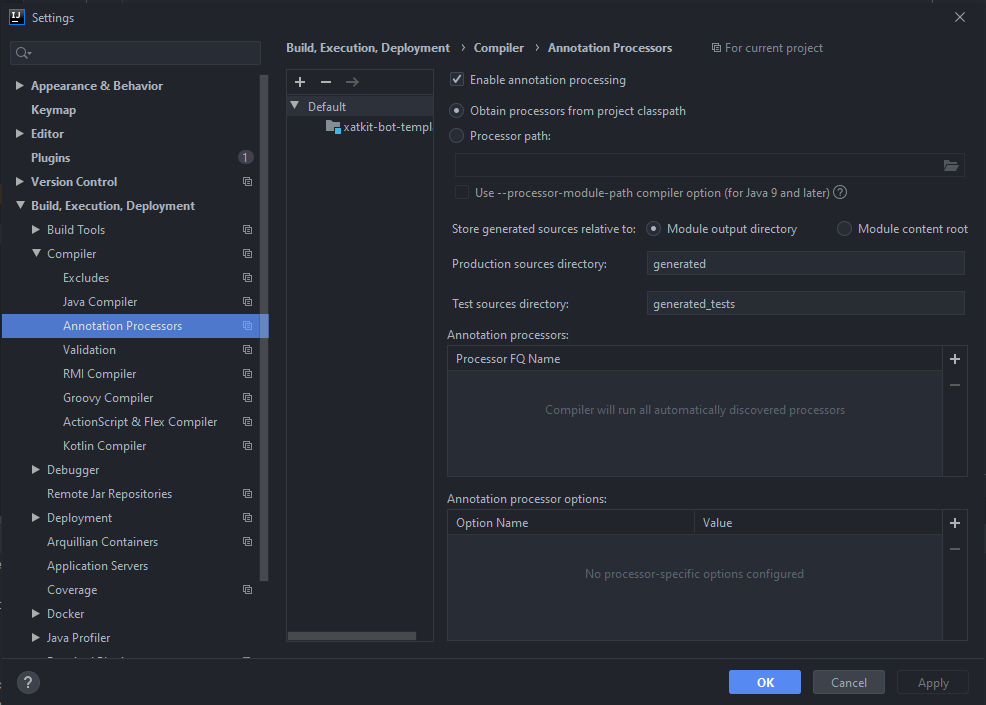

# Xatkit Bot Template
This repository contains a template maven project pre-configured with the required dependencies to help you get started with your new bot.

## What's included in this template?
The maven project in this template embeds the following dependencies:
- Xatkit Core (_com.xatkit.core_): the Xatkit SDK, this dependency contains the DSL to create Xatkit bots, as well as the runtime engine to execute them.
- Xatkit Chat Platform (_com.xatkit.chat-platform-runtime_): a generic platform representing a chat
- Xatkit React Platform (_com.xatkit.react-platform-runtime_): a platform able to connect with the [Xatkit chat widget](https://github.com/xatkit-bot-platform/xatkit-chat-widget)
- Lombok (_org.projectlombok.lombok_): a library to ease the development of Java applications (more information [here](https://projectlombok.org/))
We also configured a few testing dependencies we regularly use in our bots:
- JUnit 4.12
- AssertJ 3.14
- Mockito 3.3.3
Finally, we put an example _GreetingsBot_ in this template to help you find the API method you need to create, configure, and run your bot. You can find more information on the API in our [wiki](https://github.com/xatkit-bot-platform/xatkit/wiki).

**Note:** you can remove the Xatkit Chat Platform and Xatkit React Platform dependencies if you don't need them, but they are required to run the _GreetingsBot_ example.

## How to use the template?
Click on the button below to create a new repository from this template and follow the instructions.

## Troubleshooting
- IntelliJ error: `java: incompatible types: com.xatkit.dsl.intent.IntentOptionalTrainingSentenceStep cannot be converted to lombok.val` ➡ You need to enable annotation processing in your project (see image below).

